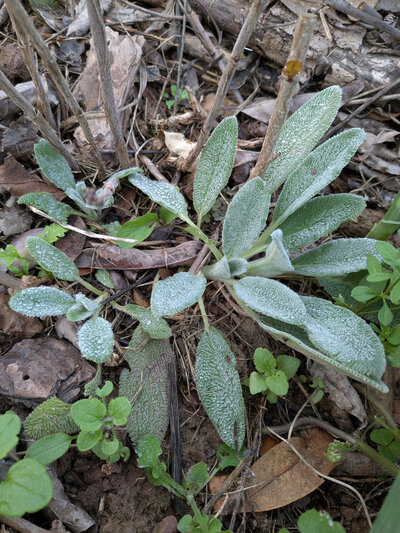
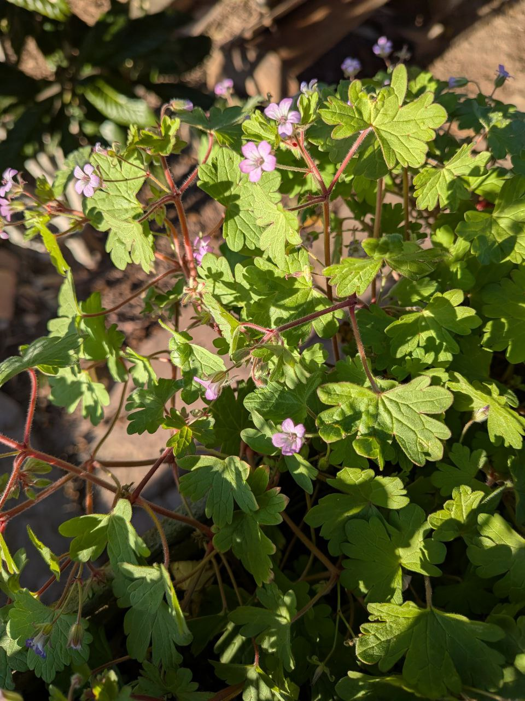

Q: Quin és el nom comú en català d'aquesta planta?

A: Orella de xai.

Q: Quin és el nom llatí d'aquesta planta?

A: *Stachys byzantina*.

---

Q: Nom en **Català**?

A: Suassana.

---

Q: Nom en **Llatí**?

A: *Geranium rotundifolium*.
